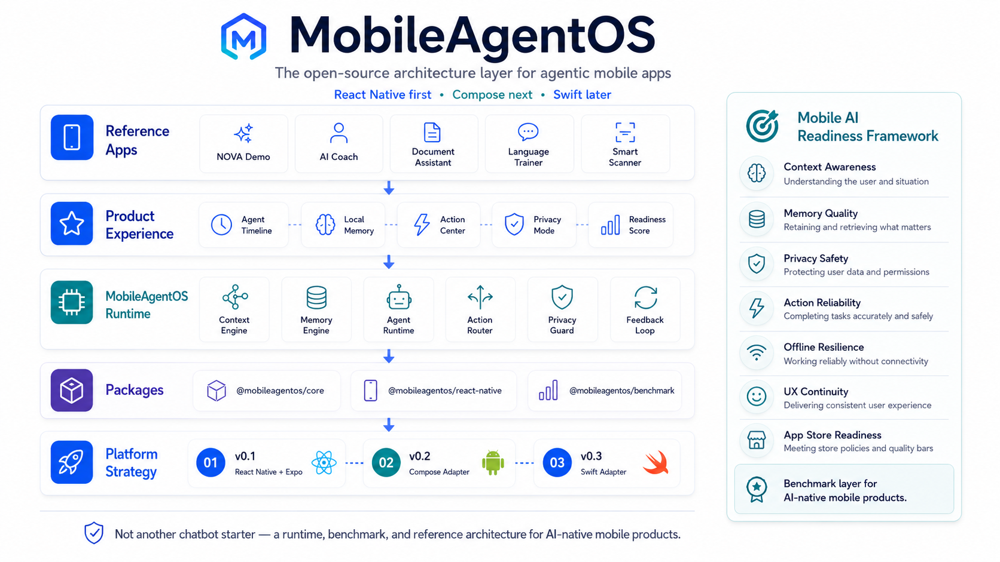
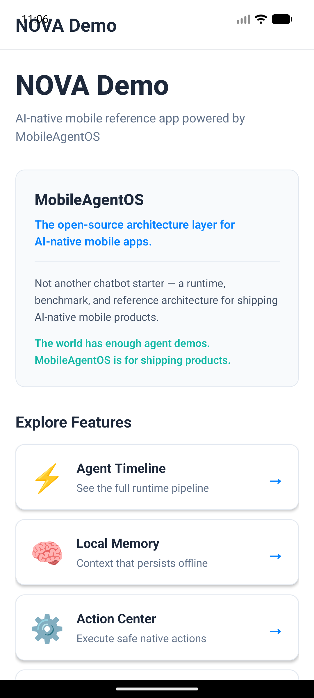

<div align="center">

 # MobileAgentOS

 **The open-source architecture layer for AI-native mobile apps**

 [](https://github.com/serkannkara/mobileagentos)
 [](./LICENSE)
 []()
 []()

 MobileAgentOS turns repeated AI-native mobile patterns into reusable architecture.  
 Build context-aware, memory-enabled, privacy-safe agent experiences for React Native and Android Compose.

 > **Not another chatbot starter template.**  
 > A production-oriented runtime, benchmark framework, and reference architecture for shipping AI-native mobile products.

 [Quick Start](#-quick-start) · [Demo Apps](#-demo-apps) · [Documentation](#-documentation) · [Roadmap](#-roadmap)

 </div>

<p align="center">
  
</p>

---

 ---

 ## 🎯 The Problem

 Most AI mobile apps start as chatbots with a text input and LLM output.

 But **real AI-native mobile products** need:

 - 🧠 **Context awareness** — understanding the user, device state, and situation
 - 💾 **Local memory** — retaining and retrieving what matters across sessions
 - 🔒 **Privacy boundaries** — protecting PII before it leaves the device
 - ⚡ **Native actions** — executing real tasks, not just generating text
 - 📡 **Offline resilience** — working reliably without constant connectivity
 - 🎨 **UX continuity** — delivering consistent experiences across platforms
 - 📊 **Readiness measurement** — knowing when you're production-ready

 **MobileAgentOS** provides these patterns as reusable architecture, not one-off implementations.

 ---

 ## ✨ What You Get

 ### 🏗️ Runtime Architecture

 A **platform-agnostic pipeline** that works on React Native (v0.1) and native Android Compose (v0.2):

 ```
 User Input
   ↓
 Context Snapshot    → Device state, user preferences, app context
   ↓
 Memory Retrieval    → Search and rank relevant local memories
   ↓
 Privacy Guard       → PII detection and redaction (email, phone, tokens, etc.)
   ↓
 Agent Runtime       → Orchestrates the full pipeline
   ↓
 Action Router       → Executes native actions with policy enforcement
   ↓
 Feedback Loop       → Tracks events and user feedback
   ↓
 Readiness Score     → 7-dimension quality measurement (0-100)
 ```

 ### 📦 What's Included

 #### TypeScript Packages (v0.1 — React Native + Expo)

 - **`@mobileagentos/core`** — Core runtime primitives (context, memory, privacy, actions, feedback, readiness)
 - **`@mobileagentos/react-native`** — React Native hooks and UI components
 - **`@mobileagentos/benchmark`** — Readiness scoring and benchmark CLI
 - **`apps/nova-demo`** — Full-featured React Native reference app (6 screens)

 #### Android Packages (v0.2 — Native Compose)

 - **`packages/compose`** — Native Kotlin runtime with Jetpack Compose UI components
 - **`apps/nova-compose-demo`** — Native Android reference app (6 screens, Material 3)

 **Key Point:** This is **NOT** a React Native Fabric bridge. v0.2 is a native Android implementation with zero RN/Expo/Fabric dependency. Same architecture, different platform.

 ---

 ## 📱 NOVA Demo

 **NOVA** is the reference mobile app for MobileAgentOS, demonstrating how the runtime pipeline, local memory, privacy checks, safe actions, feedback loop, and readiness scoring compose into an AI-native mobile product experience.

 Built with **React Native + Expo** (v0.1), NOVA showcases the full MobileAgentOS architecture in action.

 <p align="center">
   
 </p>

 <p align="center">
   <em>NOVA Demo running on Android development build.</em>
 </p>

 **Features:**
 - 🎬 **Agent Timeline** — Visualize the 8-event runtime pipeline
 - 💾 **Local Memory** — Store and retrieve user memories with tags
 - ⚡ **Action Center** — Execute safe actions with policy enforcement
 - 🔒 **Privacy Mode** — Test PII detection on email, phone, tokens, etc.
 - 📊 **Readiness Score** — 7-dimension AI quality measurement

 > **Note:** A native Android Compose version (NOVA Compose Demo) is also available in v0.2 with identical features.

 ---

 ## 📋 Requirements

 ### For React Native (v0.1)

 - **Node.js** 20 or 22 LTS (recommended: 22)
 - **pnpm** 9+
 - **Expo CLI** (installed automatically with `pnpm install`)
 - **iOS Simulator** (Mac only) or **Android Emulator** with development build

 > **Note:** For Android emulator testing, a development build is recommended over Expo Go due to potential module compatibility issues.

 ### For Android Compose (v0.2)

 - **JDK** 17+ or Android Studio JBR
 - **Android SDK** 24+ (API Level 24 or higher)
 - **Android Studio** Hedgehog or later (optional but recommended)
 - **Gradle** 8.7 (included via wrapper — no system Gradle needed)

 ---

 ## 🚀 Quick Start

 ### Option 1: React Native + Expo (v0.1)

 ```bash
 # Clone the repo
 git clone https://github.com/serkannkara/mobileagentos.git
 cd mobileagentos

 # Install dependencies
 pnpm install

 # Build TypeScript packages
 pnpm build

 # Run tests
 pnpm test

 # Run NOVA Demo (React Native)
 cd apps/nova-demo
 pnpm start --clear
 ```

 **For iOS:** Press `i` to open iOS simulator  
 **For Android development build:**

 ```bash
 # Build and install development build (first time)
 cd apps/nova-demo
 npx expo run:android

 # Start Metro bundler
 pnpm start --dev-client --clear
 ```

 ### Option 2: Native Android Compose (v0.2)

 ```bash
 # Clone the repo
 git clone https://github.com/serkannkara/mobileagentos.git
 cd mobileagentos

 # Test Compose runtime
 ./gradlew :packages:compose:test

 # Build demo app
 ./gradlew :apps:nova-compose-demo:assembleDebug

 # Install on connected device or emulator
 ./gradlew :apps:nova-compose-demo:installDebug
 ```

 **Note:** Android and TypeScript builds are independent. Running `pnpm build` does not trigger Gradle builds.

 ---

 ## 💻 Usage Examples

 ### TypeScript (React Native)

 ```typescript
 import {
   createMobileAgent,
   InMemoryStore,
   createDefaultPrivacyGuard,
   createDefaultActionRouter,
 } from "@mobileagentos/core";

 // Create agent
 const agent = createMobileAgent({
   name: "ProductivityAgent",
   userId: "user-123",
   memory: new InMemoryStore(),
   privacy: createDefaultPrivacyGuard(),
   actions: createDefaultActionRouter(),
   enableContext: true,
 });

 // Run agent
 const result = await agent.run({
   input: "Create a launch plan. I prefer short daily tasks.",
 });

 console.log(result.response);           // "Processed: Create a launch plan..."
 console.log(result.actions);            // [AgentAction, ...]
 console.log(result.readinessScore);     // 72 (out of 100)
 console.log(result.session.events);     // [input_received, context_captured, ...]
 ```

 ### Kotlin (Native Android)

 ```kotlin
 import ai.mobileagentos.compose.agent.*
 import ai.mobileagentos.compose.memory.*
 import ai.mobileagentos.compose.privacy.PrivacyGuard

 // Create agent
 val agent = MobileAgentRuntime(
     AgentConfig(
         name = "ProductivityAgent",
         userId = "user-123",
         context = ContextEngine(),
         memory = MemoryEngine(InMemoryStore()),
         privacy = PrivacyGuard(),
         actions = ActionRouter()
     )
 )

 // Run agent (suspend function)
 val result = agent.run(
     AgentInput("Create a launch plan. I prefer short daily tasks.")
 )

 println(result.response)            // "Processed: Create a launch plan..."
 println(result.actions)             // listOf(...)
 println(result.readinessScore)      // 72
 println(result.events)              // listOf(INPUT_RECEIVED, CONTEXT_SNAPSHOT_CREATED, ...)
 ```

 ### React Native Hooks

 ```typescript
 import { useAgent, useAgentMemory } from "@mobileagentos/react-native";

 function MyScreen() {
   const { run, loading, error, getSession } = useAgent();
   const { addMemory, listMemories } = useAgentMemory();

   const handleSubmit = async () => {
     await run({ input: "Help me focus today" });
     const session = getSession();
     console.log(session.events); // Full pipeline events
   };

   return <AgentTimeline events={getSession()?.events || []} />;
 }
 ```

 ### Jetpack Compose

 ```kotlin
 import ai.mobileagentos.compose.ui.*

 @Composable
 fun MyScreen() {
     val agentState = rememberAgentState()

     Button(onClick = {
         agentState.run(AgentInput("Help me focus today"))
     }) {
         Text("Run Agent")
     }

     if (agentState.loading) {
         CircularProgressIndicator()
     }

     agentState.output?.let { output ->
         AgentTimeline(events = output.events)
         ReadinessBadge(readinessScore = output.readinessScore)
     }
 }
 ```

 ---

 ## 🏛️ Architecture

 ### Core Concepts

 | Concept | Purpose | v0.1 (TypeScript) | v0.2 (Kotlin) |
 |---------|---------|-------------------|---------------|
 | **AgentRuntime** | Orchestrates pipeline | `AgentRuntime` class | `MobileAgentRuntime` class |
 | **ContextEngine** | Captures device/user context | `ContextEngine` | `ContextEngine` |
 | **MemoryStore** | Stores and retrieves memories | `InMemoryStore` | `InMemoryStore` (thread-safe) |
 | **PrivacyGuard** | Detects and redacts PII | `PrivacyGuard` | `PrivacyGuard` (6 PII types) |
 | **ActionRouter** | Executes native actions | `ActionRouter` | `ActionRouter` |
 | **FeedbackLoop** | Tracks events and feedback | `FeedbackLoop` | `FeedbackLoop` |
 | **ReadinessScore** | Measures AI readiness | `ReadinessScore` | `ReadinessScore` (7 dimensions) |

 ### Pipeline Events

 Every agent run emits 8 standardized events:

 1. **`INPUT_RECEIVED`** — User input captured
 2. **`CONTEXT_SNAPSHOT_CREATED`** — Device and user context captured
 3. **`MEMORY_RETRIEVED`** — Relevant memories retrieved
 4. **`PRIVACY_CHECKED`** — PII detected and redacted
 5. **`AGENT_RESPONSE_GENERATED`** — Response created
 6. **`ACTIONS_SUGGESTED`** — Actions prepared for execution
 7. **`READINESS_CALCULATED`** — Quality score computed
 8. **`SESSION_COMPLETED`** — Full pipeline finished

 These events enable **full observability** into your AI agent's behavior.

 ---

 ## 📊 Mobile AI Readiness Framework

 MobileAgentOS includes a **7-dimension readiness framework** to measure whether your AI-native mobile app is production-ready:

 | Dimension | Weight | What It Measures |
 |-----------|--------|------------------|
 | **Context Awareness** | 15% | Understanding user, device state, and situation |
 | **Memory Quality** | 15% | Retaining and retrieving what matters |
 | **Privacy Safety** | 20% | Protecting PII and user data |
 | **Action Reliability** | 20% | Completing tasks accurately and safely |
 | **Offline Resilience** | 10% | Working without constant connectivity |
 | **UX Continuity** | 10% | Consistent experience across sessions |
 | **App Store Readiness** | 10% | Meeting store policies and quality bars |

 ### Readiness Tiers

 - 🔴 **0-40:** Not ready — critical gaps exist
 - 🟡 **41-70:** Needs work — ship with caution
 - 🟢 **71-85:** Good — ready for beta testing
 - 🟦 **86-100:** Excellent — production-ready

 ```typescript
 const result = await agent.run({ input: "..." });
 console.log(result.readinessScore); // 72 → Good (ready for beta)
 ```

 ---

 ## 📱 Demo Apps

 ### NOVA Demo (React Native)

 Full-featured reference app demonstrating MobileAgentOS in React Native:

 **Screens:**
 - 🏠 **Home** — Overview and feature navigation
 - 🎬 **Agent Timeline** — Visual pipeline with real-time events
 - 💾 **Local Memory** — Add, retrieve, and manage memories
 - ⚡ **Action Center** — Execute and track native actions
 - 🔒 **Privacy Mode** — Test PII detection and redaction
 - 📊 **Readiness Score** — See your 7-dimension quality score

 ```bash
 cd apps/nova-demo
 pnpm start --clear
 ```

 **For Android emulator testing, use a development build:**

 ```bash
 npx expo run:android
 pnpm start --dev-client --clear
 ```

 ### NOVA Compose Demo (Native Android)

 Native Android app with identical features, built with Jetpack Compose and Material 3:

 **Screens:**
 - 🏠 **Home** — Overview and feature navigation
 - 🎬 **Agent Timeline** — Process input and view 8 pipeline events
 - 💾 **Local Memory** — Add memories with tags and importance scores
 - ⚡ **Action Center** — Execute test actions and view results
 - 🔒 **Privacy Mode** — Live PII detection with redaction report
 - 📊 **Readiness Score** — Calculate and visualize AI readiness

 ```bash
 ./gradlew :apps:nova-compose-demo:assembleDebug
 ./gradlew :apps:nova-compose-demo:installDebug
 ```

 ---

 ## 🤔 When to Use MobileAgentOS

 ### ✅ **Use MobileAgentOS if you're building:**

 - AI-native mobile apps that need context awareness
 - Apps with local memory and personalization
 - Privacy-first AI experiences
 - Multi-action agent workflows
 - Production mobile products (not experiments)
 - Cross-platform AI experiences (RN + Android + iOS)

 ### ❌ **Don't use MobileAgentOS if you need:**

 - Just a simple chatbot UI (use a chat library instead)
 - Server-side agent orchestration only
 - Web-only experiences
 - Real-time LLM streaming (not yet supported in v0.2)
 - Production persistence (v0.2 is in-memory only)

 ---

 ## ⚠️ Current Limitations (v0.2)

 MobileAgentOS v0.2 is a **foundation release**. These limitations are intentional and will be addressed in future versions:

 - ❌ **No real LLM provider integration** — Responses are deterministic ("Processed: {input}")
 - ❌ **In-memory storage only** — No Room/DataStore/CoreData persistence yet
 - ❌ **No streaming responses** — Full response only
 - ❌ **No cloud sync** — Memories are local and session-scoped
 - ❌ **Limited context signals** — Basic device/user context only
 - ❌ **No multi-agent coordination** — Single agent per runtime

 See [Roadmap](#-roadmap) for upcoming features.

 ---

 ## 🗺️ Roadmap

 ### ✅ v0.1 — React Native + Expo (Shipped)

 - ✅ Core runtime architecture
 - ✅ Context engine with signal capture
 - ✅ In-memory memory store with relevance-based retrieval
 - ✅ Privacy guard with 6 PII types (email, phone, token, API key, credit card, SSN)
 - ✅ Action router with policy enforcement
 - ✅ Feedback loop with event tracking
 - ✅ 7-dimension readiness framework
 - ✅ NOVA Demo app (6 screens)
 - ✅ React Native hooks and components
 - ✅ Unit tests and documentation

 ### ✅ v0.2 — Native Android Compose Adapter (Shipped)

 - ✅ Kotlin runtime implementation
 - ✅ Jetpack Compose UI adapter
 - ✅ Material 3 design system
 - ✅ NOVA Compose Demo (6 screens)
 - ✅ Thread-safe InMemoryStore with Coroutines
 - ✅ Unit tests (PrivacyGuard, InMemoryStore, ActionRouter, ReadinessScore, MobileAgentRuntime)
 - ✅ Documentation and migration guide
 - ✅ **Zero React Native / Expo / Fabric dependency**

 **Note:** v0.2 is not a React Native Fabric bridge. It's a native Android implementation proving the architecture is platform-agnostic.

 ### 🚧 v0.3 — Native iOS Swift Adapter (Next)

 - [ ] Swift package with runtime concepts
 - [ ] SwiftUI components and state management
 - [ ] iOS-native reference app
 - [ ] CoreML integration for local models
 - [ ] App Store readiness checks
 - [ ] Keychain integration for secure storage

 ### 🔮 v0.4 — Production Enhancements (Planned)

 - [ ] Persistent storage adapters (Room, DataStore, CoreData)
 - [ ] Real LLM provider integrations (OpenAI, Anthropic, local models)
 - [ ] Streaming responses
 - [ ] Multi-agent coordination
 - [ ] Advanced context signals (location, activity, calendar)
 - [ ] Cloud sync for memories
 - [ ] Analytics and observability dashboard

 ---

 ## 🔧 Troubleshooting

 ### React Native Issues

 **Problem:** `pnpm build` fails  
 **Solution:** Ensure Node.js 20 or 22 is installed: `node --version`

 **Problem:** Expo app crashes on startup  
 **Solution:** Clear cache: `cd apps/nova-demo && pnpm start --clear`

 **Problem:** Module not found errors  
 **Solution:** Rebuild packages: `pnpm clean && pnpm install && pnpm build`

 **Problem:** Android development build fails  
 **Solution:** Ensure Android SDK is configured: Check `local.properties` or set `ANDROID_HOME`

 ### Android Compose Issues

 **Problem:** `SDK location not found`  
 **Solution:** Create `local.properties` with: `sdk.dir=/path/to/Android/sdk`

 **Problem:** Gradle daemon errors  
 **Solution:** Kill daemons: `./gradlew --stop` then rebuild

 **Problem:** Compilation errors in Compose  
 **Solution:** Ensure JDK 17 is active: `java -version`

 ### General Issues

 For more help, see [GitHub Issues](https://github.com/serkannkara/mobileagentos/issues).

 ---

 ## 📚 Documentation

 - [**Getting Started Guide**](./docs/getting-started.md) — Installation and first agent
 - [**Architecture Deep Dive**](./docs/architecture.md) — Core concepts and design decisions
 - [**Compose Adapter Guide**](./docs/compose-adapter.md) — Native Android implementation
 - [**API Reference**](./docs/api-reference.md) — Complete API documentation
 - [**Migration Guide**](./docs/migration.md) — Upgrading between versions
 - [**Contributing Guide**](./CONTRIBUTING.md) — How to contribute

 ---

 ## 🛡️ Security & Privacy

 ### Privacy Guard Capabilities

 MobileAgentOS includes client-side PII detection using regex patterns:

 - ✅ **Email addresses** — `john@example.com` → `[REDACTED_EMAIL]`
 - ✅ **Phone numbers** — `555-123-4567` → `[REDACTED_PHONE]`
 - ✅ **API keys** — `sk_test_123...` → `[REDACTED_API_KEY]`
 - ✅ **Tokens** — Long alphanumeric strings → `[REDACTED_TOKEN]`
 - ✅ **Credit cards** — `4111-1111-1111-1111` → `[REDACTED_CREDIT_CARD]`
 - ✅ **SSN** — `123-45-6789` → `[REDACTED_SSN]`

 ### Limitations

 - **Regex-based detection** — May miss edge cases or sophisticated PII
 - **No ML-based detection** — Currently pattern-matching only
 - **Client-side only** — No server-side validation
 - **Best effort** — Not a replacement for comprehensive data protection policies

 **Recommendation:** Use PrivacyGuard as a first line of defense, not the only line.

 ---

 ## 🤝 Contributing

 We welcome contributions from mobile engineers building AI-native products!

 **Ways to contribute:**
 - 🐛 Report bugs and issues
 - 💡 Propose new features or improvements
 - 📝 Improve documentation
 - 🧪 Add tests
 - 🎨 Build new UI components
 - 🔌 Create new platform adapters (Flutter, Unity, etc.)

 See [CONTRIBUTING.md](./CONTRIBUTING.md) for guidelines.

 ---

 ## 📄 License

 MIT License — see [LICENSE](./LICENSE) for details.

 ---

 ## 🌍 Community

 MobileAgentOS is built for:

 - 📱 **Mobile product builders** shipping AI-native apps
 - 🏗️ **Platform engineers** building reusable AI infrastructure
 - 🚀 **Startup founders** moving fast without reinventing patterns
 - 🎓 **Researchers** exploring agentic mobile UX

 **The world has enough agent demos.**  
 **MobileAgentOS is for shipping AI-native mobile products.**

 ---

 <div align="center">

 Made with ❤️ by mobile engineers building the future of AI-native apps

 [⭐ Star on GitHub](https://github.com/serkannkara/mobileagentos) · [📖 Read the Docs](./docs)

 </div>
